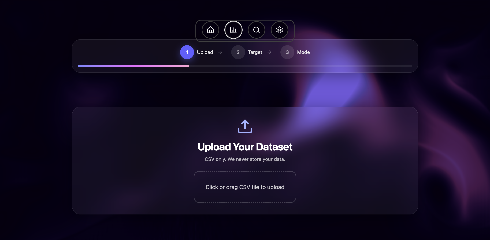
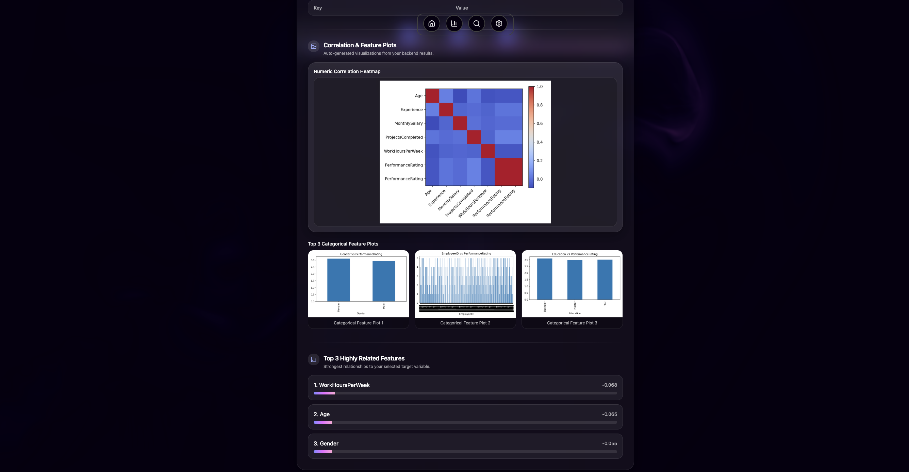
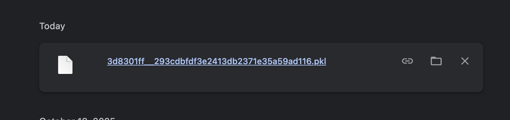

<h1 align="center">📊 <em>ML-ify</em> 🤖</h1>
<p align="center">
  🌐 <a href="#" target="_blank">Live Demo</a>
</p>

<div align="center">


<p align="center">
  
</p>

### 🎯 *Analyze Datasets, Generate Insights, Train ML Models* 🎯

*A full-stack web application to analyze datasets, generate business insights, visualize features, and train ML models with downloadable outputs.*

<p align="center">
  
  
  
  
</p>

---


</div>

## 🌟 **Features**

### 📤 **Dataset Upload & Processing**

<div align="center">



</div>

- Upload CSV datasets securely
- Detect missing values and basic imputation
- Separate categorical and numeric features
- Interactive file handling

---

### 📊 **Data Analysis & Visualization**

<div align="center">



</div>

- Auto-generated business insights
- Interactive charts and graphs
- Feature correlation analysis
- Missing value detection

---

### 🤖 **ML Model Training**

<div align="center">


</div>

- Train ML models (Linear Regression, Logistic Regression, Random Forest)
- Automatic preprocessing pipeline
- One-hot encoding for categorical features
- Model performance metrics

---

### 💾 **Downloadable Outputs**

<div align="center">



</div>

- Download trained model as `.pkl`
- Export charts and visualizations
- Save analysis reports
- AI-driven insights (optional)

---

### 🎯 **Interactive Frontend**

<div align="center">


</div>

- Progress steps visualization
- Real-time analysis feedback
- Responsive design with Tailwind CSS
- User-friendly interface

---

<div align="center">

</div>

## 🛠️ **Tech Stack**

<div align="center">

<table>
<tr>
<td align="center" width="20%">

<br><strong>React</strong>
<br><em>Frontend Framework</em>
</td>
<td align="center" width="20%">

<br><strong>Tailwind CSS</strong>
<br><em>Styling</em>
</td>
<td align="center" width="20%">

<br><strong>FastAPI</strong>
<br><em>Backend Framework</em>
</td>
<td align="center" width="20%">

<br><strong>Python</strong>
<br><em>Backend Language</em>
</td>
<td align="center" width="20%">

<br><strong>Scikit-learn</strong>
<br><em>Machine Learning</em>
</td>
</tr>
</table>

</div>

### 📋 **Complete Stack Breakdown**

<table>
<tr>
<td width="50%">

#### 🌐 **Frontend**
- **React** → UI framework
- **Tailwind CSS** → Utility-first styling
- **JavaScript** → Client-side logic

#### 🚀 **Backend**
- **FastAPI** → High-performance API
- **Python** → Core language
- **uvicorn** → ASGI server

</td>
<td width="50%">

#### 🤖 **ML & Data**

- **Random Forest** → Complex modeling


#### 💾 **Storage**
- Local file system (uploads/, models/)
- Can integrate with **Supabase Storage**

</td>
</tr>
</table>

---

## 📁 **Project Structure**

```
project-root/
│
├── 📁 backend/
│   ├── 📁 app/
│   │   ├── 📄 main.py          # FastAPI main app
│   │   ├── 📄 models.py        # ML models and pipelines
│   │   ├── 📄 routes.py        # API routes
│   │   ├── 📄 utils.py         # Helper functions
│   │   └── 📄 requirements.txt # Backend dependencies
│   └── 📄 .env                 # Environment variables
│
├── 📁 frontend/
│   ├── 📁 src/
│   │   ├── 📁 components/      # Reusable UI components
│   │   ├── 📁 pages/           # React pages
│   │   │   ├── 📄 StartAnalysis.jsx
│   │   │   └── 📄 Analysis.jsx
│   │   ├── 📄 App.jsx
│   │   └── 📄 index.jsx
│   └── 📄 package.json
│
├── 📁 dataset_samples/         # Sample CSVs
├── 📁 uploads/                 # Uploaded datasets
├── 📁 models/                  # Trained models
├── 📁 plots/                   # Generated charts
└── 📄 README.md
```

---

## 🚀 **Installation & Setup**

<div align="center">

</div>

### **1️⃣ Clone the repository**

```bash
git clone <your-repo-url>
cd project-root
```

---

### **2️⃣ Backend Setup (FastAPI)**

<div align="center">


</div>

#### **Create a virtual environment**

```bash
cd backend
python -m venv venv
source venv/bin/activate       # Linux/macOS
venv\Scripts\activate          # Windows
```

#### **Install dependencies**

```bash
pip install -r requirements.txt
```

#### **Run FastAPI**

```bash
uvicorn app.main:app --reload
```

<div align="center">

🎉 **Backend API accessible at:** `http://127.0.0.1:8000`

</div>

---

### **3️⃣ Frontend Setup (React)**

<div align="center">


</div>

#### **Install frontend dependencies**

```bash
cd frontend
npm install
```

#### **Run React dev server**

```bash
npm start
```

<div align="center">

🎉 **Frontend accessible at:** `http://localhost:3000`

</div>

---

### **4️⃣ Environment Variables**

Create a `.env` file in the `backend/` folder:

```ini
# Server Configuration
SECRET_KEY=your_secret_key

# File Paths
UPLOAD_FOLDER=uploads/
MODEL_FOLDER=models/
PLOTS_FOLDER=plots/

# Optional: Cloud Storage
SUPABASE_URL=your_supabase_url
SUPABASE_KEY=your_supabase_key
```

---

<div align="center">

</div>

## 📖 **Usage Guide**

<div align="center">


</div>

<table>
<tr>
<td width="25%">

### **Step 1️⃣**
**Upload CSV**

Upload your dataset and let the platform analyze it

</td>
<td width="25%">

### **Step 2️⃣**
**Select Target**

Choose the target column for prediction

</td>
<td width="25%">

### **Step 3️⃣**
**Choose Analysis**

Select between:
- Business Insights
- Train ML Models

</td>
<td width="25%">

### **Step 4️⃣**
**View Results**

Analyze:
- Missing values
- Feature types
- Correlations
- AI insights

</td>
</tr>
</table>

---

## 🤖 **ML Models**

<div align="center">


</div>

<div align="center">

| Model | Use Case | Description |
|-------|----------|-------------|
| 📈 **Linear Regression** | Numeric Target | Predict continuous values |
| 🎯 **Logistic Regression** | Categorical Target | Binary/Multi-class classification |
| 🌲 **Random Forest** | Complex Patterns | Feature importance & high accuracy |

</div>

### 🔧 **Model Pipeline**

- **Preprocessing**: Automatic one-hot encoding for categorical features
- **Training**: Fit on uploaded dataset
- **Evaluation**: Performance metrics displayed
- **Export**: Download as `.pkl` file

---

## 💾 **File & Storage Handling**

<div align="center">


</div>

### 📂 **Local Storage Structure**

```
uploads/          # Uploaded CSV datasets
models/           # Trained pickle files (.pkl)
plots/            # Generated charts and visualizations
```

### ☁️ **Cloud Integration**

Can integrate with:
- **Supabase Storage** → Scalable file storage
- **Firebase Storage** → Google Cloud integration
- **AWS S3** → Enterprise-grade storage

Update paths in `utils.py` or `main.py` for cloud storage.

---

## 📊 **Analysis Features**

### 🔍 **Data Insights**

<div align="center">


</div>

- Missing value detection and imputation
- Feature type identification (categorical vs numeric)
- Correlation analysis
- Top related features
- Distribution plots

### 📈 **Visualizations**

<div align="center">


</div>

- Correlation heatmaps
- Feature distribution plots
- Missing value charts
- Target variable analysis

### 🤖 **AI-Generated Insights**

<div align="center">


</div>

- Human-readable business insights
- Automated pattern detection
- Feature importance explanations
- Predictive recommendations

---

## 🤝 **Contributing**

<div align="center">


</div>

### 🎯 **How to Contribute**

1. **🍴 Fork** the repository
2. **🌿 Create** a branch
   ```bash
   git checkout -b feature/your-feature
   ```
3. **💻 Commit** changes
   ```bash
   git commit -m "Add new feature"
   ```
4. **📤 Push** to branch
   ```bash
   git push origin feature/your-feature
   ```
5. **🔄 Create** a Pull Request

---

## 📄 **License**

<div align="center">

**MIT License** © [Your Name]


</div>

---

## 💡 **Demo & Screenshots**

<div align="center">

### 🖥️ **Application Workflow**


*Complete analysis workflow from upload to model download*

</div>

---

<div align="center">


### ⭐ **If you found this project helpful, please consider giving it a star!** ⭐


</div>